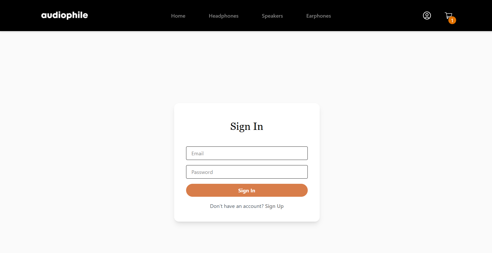

# Audiophile E-Commerce Website

Welcome to my Audiophile E-Commerce project! This is a modern, full-featured e-commerce web application built to showcase my skills in frontend engineering, state management, and scalable architecture using the latest technologies.

## 🚀 Project Overview

Audiophile is a responsive e-commerce platform for audio products, designed with a focus on user experience, performance, and maintainability. The project demonstrates advanced React development, TypeScript best practices, and robust state management with Redux Toolkit.


## 🛠️ Tech Stack

- **Vite** – Lightning-fast build tool for modern web projects
- **React** – Component-based UI library
- **TypeScript** – Type-safe, scalable JavaScript
- **Tailwind CSS** – Utility-first CSS framework for rapid UI development
- **Redux Toolkit** – Predictable, scalable state management
- **AWS Cognito & AWS Amplify** – Cloud-based authentication and user management
- **ESLint & Prettier** – Code quality and formatting


## ✨ Key Features

- **Authentication**: Secure sign up, sign in, and protected routes using AWS Cognito and AWS Amplify for robust, scalable cloud authentication
- **Product Catalog**: Browse products by category, view detailed product pages
- **Cart & Checkout**: Add/remove items, persistent cart, order summary, and address form
- **User Profile**: View and manage user information
- **Responsive Design**: Mobile-first, works seamlessly across devices
- **API Integration**: Modular API client architecture for scalable backend integration
- **State Management**: Advanced usage of Redux Toolkit for cart, user, and product state
- **Type Safety**: End-to-end TypeScript for reliability and maintainability
- **Reusable Components**: Modular, accessible, and well-tested UI components


## 🧑‍💻 Skills Demonstrated

- **Modern React Patterns**: Hooks, context, code splitting, and lazy loading
- **Advanced State Management**: Normalized state, async thunks, and selectors with Redux Toolkit
- **TypeScript Mastery**: Custom types, interfaces, and generics for robust code
- **Cloud Authentication**: Integration and configuration of AWS Cognito and AWS Amplify for secure, scalable user authentication
- **UI/UX Design**: Tailwind CSS for rapid prototyping and pixel-perfect layouts
- **Testing & Quality**: Linting, formatting, and scalable folder structure
- **API Abstraction**: Clean separation of concerns with API client factory pattern
- **Performance Optimization**: Efficient rendering, code splitting, and asset management

## 📂 Project Structure

The codebase is organized for scalability and maintainability:

- `src/components/` – Reusable UI components (Cart, Navbar, Product, Auth, Form, etc.)
- `src/pages/` – Route-based pages (Checkout, Product Details, Sign In/Up, etc.)
- `src/redux/` – Redux Toolkit slices for state management
- `src/utils/` – Utility functions for formatting, validation, and more
- `src/data/` – Mock product data for development
- `src/assets/` – Images, fonts, and styles

## 📸 Screenshots

> 

## 📝 Getting Started

1. **Install dependencies:**
    ```bash
    npm install
    ```
2. **Start the development server:**
    ```bash
    npm run dev
    ```
3. **Open in browser:**
    Visit [http://localhost:5173](http://localhost:5173)

## 🤝 Why Hire Me?

- Proven ability to build scalable, maintainable, and beautiful web applications
- Deep understanding of React, TypeScript, and modern frontend tooling
- Strong focus on code quality, performance, and user experience
- Experience with real-world e-commerce flows and best practices

---

_Thank you for checking out my project! If you’d like to discuss opportunities or see more of my work, feel free to connect._